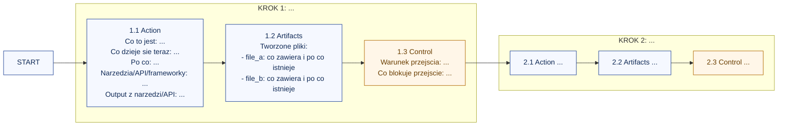
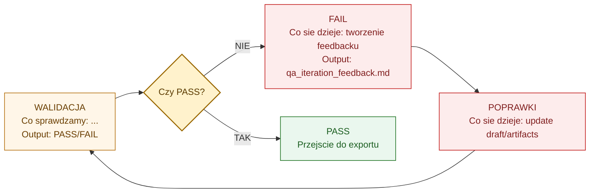
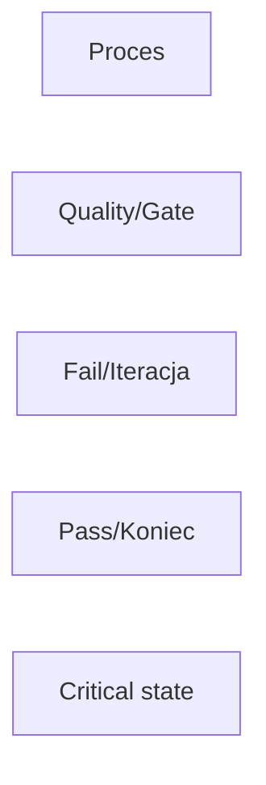
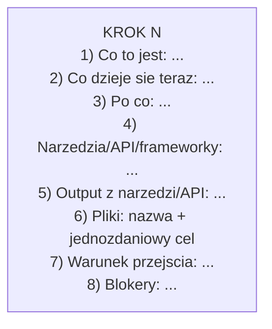

# Diagram Templates (Mermaid) for Documentation-Grade Workflows

Use these templates as a structure baseline, then inject workflow-specific facts.

## Template A: Step Section with Action + Artifacts + Control

## Template B: Decision + Recovery Loop

## Template C: Legend Block

## Template D: Full Step Example (Compact but Complete)

## Template Usage Notes
1. Use full sentences for documentation fields.
2. Keep one-sentence purpose per listed file.
3. Do not invent unknown details; verify first.
4. Keep LR globally, TB internally.
5. Keep decision logic explicit with labeled branches.
